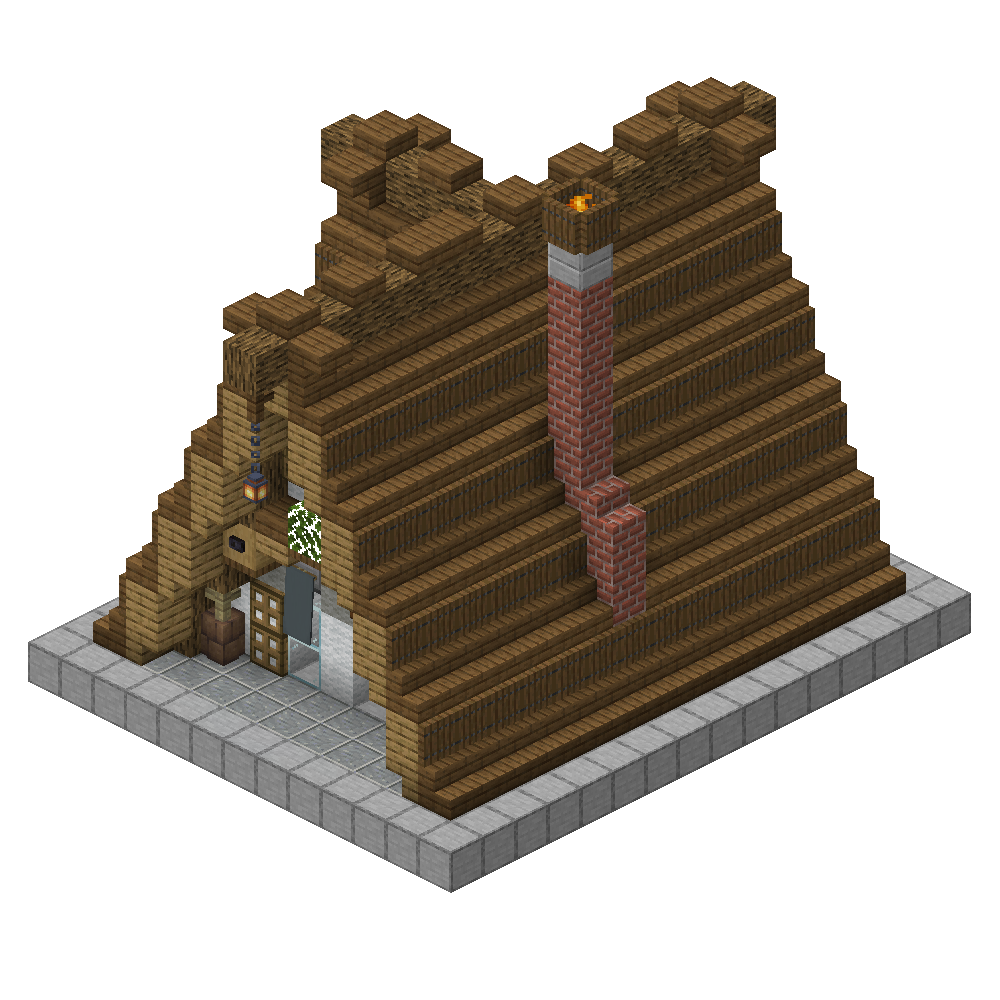
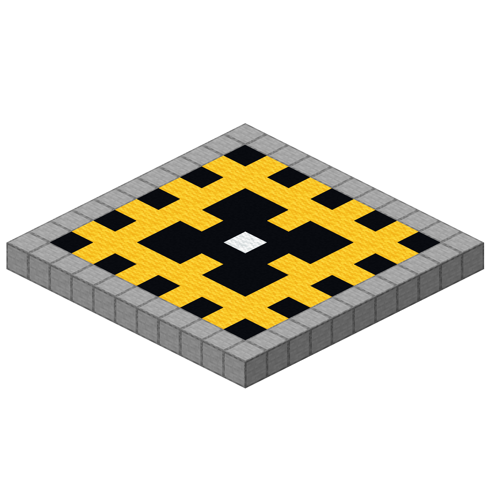

# Mactory

**맥토리**는 [`Minecraft`](https://en.wikipedia.org/wiki/Minecraft)내에서 제작된 공장 게임으로,  
게임 내에서 자원을 추출하고, 단순한 자원들로 복잡한 아이템들을 제작하며, 무수히 많은 공장을 건설하여 즐기면 되는 아주 간단한 형식의 **1인용** 게임입니다.

시스템을 위해 전용 리소스팩이 쓰이기도 합니다.

# 시작

## 집

<left></left>

> 당신이 이 작업을 시작하는 장소겸, 자원들을 보관하는 장소입니다.  
> 여기서 나갈 준비를 하여, 게임을 시작할 수 있습니다. 공장을 제작하는 와중에도 맵에 위치됩니다.

## 판

<left></left>

> 건축물을 설치할 수 없는 초반 지대입니다.  
> 맵의 중앙에 놓여 있습니다.
